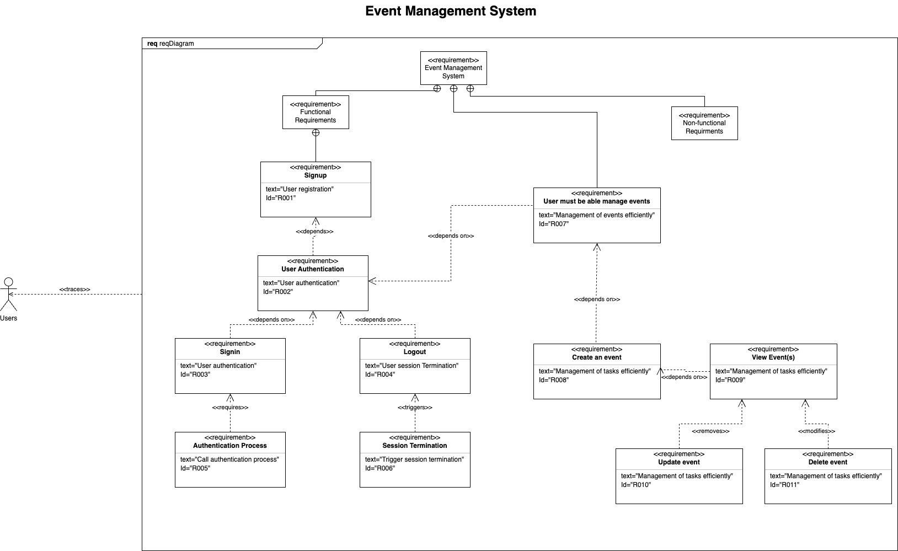

# **Assignment: Full-Stack CRUD Application Development with DevOps Practices**

## **Overview**

This assignment focuses on building a full-stack CRUD application with user authentication using Node.js, React.js, and MongoDB. Students are required to extend a starter project by implementing CRUD functionality for a real-world use case (e.g., Event Management).

## **Real-World Application**

**Event Management System** is a full-stack CRUD application for managing events, developed using _Node.js, Express, React.js, and MongoDB_. It supports user authentication and enables authenticated users to perform Create, Read, Update, and Delete operations on events. The project also follows DevOps best practices with GitHub version control, CI/CD pipelines, JIRA project management, and SysML-based requirement documentation.

## **Features**

- User Authentication using JWT
- Create, view, update, and delete events
- Protected routes for authorized access
- RESTful API with Express.js
- Responsive React frontend with forms and data tables
- MongoDB database integration
- CI/CD deployment to AWS

## **Project Management**

- JIRA Board: [JIRA Board URL ](https://sonamdargay.atlassian.net/jira/software/projects/EMS/summary)
- Requirement Diagram: [Click to download in .drawio format](https://drive.google.com/file/d/1bXZMElpsvbIE059mDgGtAwBYng40XKyz/view?usp=sharing)
  

## **Project Structure**

```
/.github
  ├── workflows/
/backend
  ├── config/
  ├── controllers/
  ├── middleware/
  ├── models/
  ├── routes/
  ├── test/
  ├── .env
  ├── server.js
  ├── package.json
/frontend
  ├── src/
    ├── components/
    ├── context/
    ├── pages/
    ├── App.js
    ├── axiosConfig.jsx
    ├── App.js
    ├── index.js
package.json
README.md
```

## **Setup Instructions**

### **1. Clone the Repository**

```
git clone https://github.com/sonamdargay/IFN636-assessment1.git
cd IFN636-assessment1
```

### **2. Install Dependencies**

```
npm run install-all
```

### **3. Configure Environment Variables**

Create a `.env` file in the `/backend` directory:

```
PORT=5001
MONGO_URI=your_mongodb_connection_string
JWT_SECRET=your_jwt_secret
```

### **4. Run the project**

From the root directory of the project run the following to start both backend and frontend services together:

```
npm run start
```

## CI/CD Pipeline

GitHub Actions is used to automate Continuous Integration (CI) and performs:

- Checks out the latest code from the repository.
- Sets up the Node.js environment, using version 22
- Loads environment secrets: `MONGO_URI`, `JWT_SECRET`, and `PORT` from GitHub Secrets
- Installs dependencies for both the backend and frontend using `yarn`
- Builds the `frontend` and clears any old build artifacts
- Runs `backend` tests to validate the functionality
- Creates a `.env` file dynamically using the secret PROD content
- Uses PM2 to manage backend processes
  - Stops any currently running processes
  - Starts or restarts all backend services using PM2 for zero-downtime restarts.
- **File Path**: `.github/workflows/backend-ci.yml`

Continuous Deployment(CD) is handled using a self-hosted runner configured on an AWS EC2 instance. The workflow continues with the following steps:

- Writes production secrets to a `.env` file on the EC2 instance.
- Restarts the backend server using `PM2`, a process manager for `Node.js`.
- Serves the frontend using `pm2 serve` on port `3000`.
- Configures Nginx to act as a reverse proxy, forwarding incoming HTTP requests to the frontend server running locally.
- Restarts both Nginx and PM2 processes to reflect the latest deployment.

## Git Branching Strategy

- Feature branches are created for each functionality:
  - `feature/create-event`
  - `feature/update-event`
  - `feature/read-event`
  - `feature/delete-event`
- After development, feature branches are merged into the `main` branch using Git commands.
- Push the `main` branch to the GitHub triggers CI/CD pipeline.
